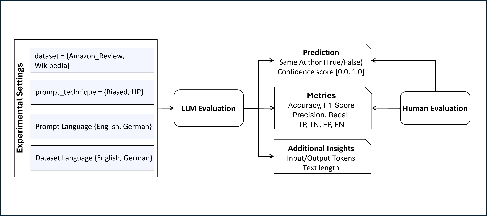

<div align="center">

# 🔍 Are LLMs capable of Authorship Verification on German Texts?

<p align="center">
  <strong>A comprehensive evaluation framework for Large Language Models on German authorship verification tasks</strong>
</p>

<p align="center">
  <a href="#-overview">Overview</a> •
  <a href="#-quick-start">Quick Start</a> •
  <a href="#-experiments">Experiments</a> •
  <a href="#-results">Results</a> •
  <a href="#-Future-Work">Future Work</a> •
  <a href="#-citation">Citation</a>
</p>

[](https://drive.google.com/file/d/1zThZfLRd4PrjS1kh7UAflooVfN6Z4DLM/view?usp=sharing)
[](https://colab.research.google.com/drive/1tFVcYmw-phUb6gdIMiPHadVo2btFu5Ow?usp=sharing)
[](https://www.python.org/downloads/)
[](https://opensource.org/licenses/MIT)

<p align="center">
  <strong>Authors:</strong><br>
  <a href="mailto:abdullah.al-labani@utn.de">Abdullah Al-Labani</a> •
  <a href="mailto:nitish.devranii@utn.de">Nitish Devrani</a> •
  <a href="mailto:timothy.leonard@utn.de">Timothy Leonard</a><br>
  <em>Department of Computer Science & Artificial Intelligence<br>
  University of Technology Nuremberg (UTN)</em>
</p>

</div>

---

## 📖 Overview

This repository contains the implementation and evaluation framework for our master’s course research investigating the capability of Large Language Models to perform authorship verification on German texts. We provide a comprehensive comparison between English and German performance across multiple state-of-the-art LLMs.

**Authorship Verification (AV)** is the task of determining whether two given texts were written by the same author. While this has been extensively studied for English, limited work exists for German texts, particularly using modern LLMs.

### 🎯 Research Questions

- **RQ1**: How well do LLMs perform on German authorship verification compared to English?
- **RQ2**: Which prompt strategies are most effective for authorship verification tasks?
- **RQ3**: How do different LLM architectures compare on this task?
- **RQ4**: What is the human baseline performance on this task?

### 🔬 Key Contributions

- **Comprehensive LLM Evaluation**: Systematic evaluation of 8 state-of-the-art LLMs (GPT-4, DeepSeek, etc.)
- **Cross-lingual Analysis**: Direct comparison of German vs English authorship verification performance
- **Prompt Engineering**: Investigation of different prompting strategies (biased vs linguistic features)
- **Human Evaluation**: GUI-based human annotation system with comparative analysis
- **Reproducible Framework**: Clean, configurable codebase for easy reproduction and extension


<div align="center">
  
  <p><em>Figure 1: Authorship Verification Processing Pipeline</em></p>
</div>


---

## 🚀 Quick Start

### Installation

```bash
# Clone the repository
git clone <your-repo-url>
cd llm-authorship-verification-german

# Install dependencies
pip install -r requirements.txt
```

### API Key Setup

Choose one of the following methods to set up your API key:

**Method 1: Using api_key.txt file**
```bash
echo "your_openai_api_key" > api_key.txt
```

**Method 2: Using .env file**
```bash
echo "OPENAI_API_KEY=your_openai_api_key" > .env
```

### Run Your First Experiment

```bash
# Run a basic German authorship verification experiment
python authorship_verification/authorship_verification.py --config configs/experiment.yaml
```

This will:
- Load 2 German text pairs from Amazon reviews
- Use GPT-4.1-mini with linguistic features prompting
- Save results to `results/german_lip_longest_gpt-4.1-mini/`

### Expected Output

```
✅ API key loaded from api_key.txt
Starting experiment with configuration:
  Dataset: amazon_review (german)
  Prompt: lip (german)
  Model: openai/gpt-4.1-mini
  Max samples: 2
Loaded top-2 longest pairs for german (by min_len).

Evaluating gpt-4.1-mini on 2 samples...
gpt-4.1-mini-experiment: 100%|████████████████████████████████████████████████████████████████████████████████████████████████████| 2/2 [00:04<00:00,  2.07s/it]

Experiment completed!
Accuracy: 0.500
F1-Score: 0.667
Total cost: $0.0010
Results saved to: results/german_lip_longest_gpt-4.1-mini

============================================================
EXPERIMENT SUMMARY
============================================================
Model: gpt-4.1-mini
Language: german
Prompt: lip
Total Samples: 2
Correct: 1
Accuracy: 0.500
F1-Score: 0.667
Cost: $0.0010
```

---

## 🧪 Experiments

### Supported Models

| Model | Provider | Parameters | Context Length |
|-------|----------|------------|----------------|
| GPT-4o | OpenAI | ~1.8T | 128K |
| GPT-4.1 | OpenAI | ~1.8T | 128K |
| GPT-4.1-mini | OpenAI | ~8B | 128K |
| GPT-4.1-nano | OpenAI | ~1B | 128K |
| DeepSeek-R1 | DeepSeek | 671B | 128K |
| DeepSeek-V3 | DeepSeek | 671B | 128K |
| O3-mini | OpenAI | ~8B | 128K |

### Prompt Strategies

#### 1. Biased Prompt
Simple, direct prompting that may introduce bias:
```
You’re a product‐review linguist on a shopping dataset. Texts are casual, everyday reviews. Decide if two texts share an author, based purely on writing style.

Return JSON with
- " analysis": Reasoning behind your answer.
- "answer": A boolean (True/False).

Keep your analysis ≤ 10 words, bullet-point style (comma-separated is fine).

Example 1:
Text A: “They lacked any kind of moisture: wouldn’t stay in my face they were so dry! Returning if possible!”
Text B: “Just as pictured. Prompt delivery. Yummmm”
analysis: “same casual contractions”
answer: true

Example 2:
Text A: “The box came really damaged. I got it for a gift and I am embarrassed to give it to him.”
Text B: “Had to do some fabrication but it works. Not perfect or really flush but it gets the job done. You get what you pay for!”
analysis: “– emotive first-person  – technical, task-focused tone another person”
answer: false

Now your turn:
Text 1: {text1}
Text 2: {text2}
```

#### 2. LIP (Linguistic Features) Prompt
Encourages analysis of linguistic features:
```
Respond only with a single JSON object including three key elements.
- " analysis": Reasoning behind your answer in few words.
- "answer": A boolean (True/False) answer.
- “score": A number between 0.0 and 1.0, where 0.0 = certain different author, 1.0 = certain same author, and values in between reflect degree of certainty (e.g., 0.9 = almost certain same, 0.1 = almost certain different).

Ensure that "answer" matches: use True if score ≥ 0.5, False if score < 0.5.

Task: Verify if two input texts were written by the same author. Analyze the writing styles of the input texts, disregarding the differences in topic and content. Reasoning based on linguistic features such as phrasal verbs, modal verbs, punctuation, rare words, affixes, quantities, humor, sarcasm, typographical errors, and misspellings.

Text 1: {text1}
Text 2: {text2}
```

### Datasets

- **Amazon Reviews**: German/English product reviews from the authorship verification dataset
- **Wikipedia**: Planned support for Wikipedia articles (future work)

### Data Loading Strategies

- **Random**: Standard random sampling (default)
- **Longest**: Select text pairs with longest minimum length
- **Shortest**: Select text pairs with shortest maximum length  
- **Longest Balanced**: Longest pairs with balanced same/different author labels
- **Shortest Balanced**: Shortest pairs with balanced same/different author labels

---

## ⚙️ Configuration

### Basic Configuration

Create or modify `configs/experiment.yaml`:

```yaml
# Experiment identification
experiment_name: "german_lip_experiment"
description: "German authorship verification with linguistic features prompt"

# Dataset configuration
dataset: "amazon_review"  # Options: "amazon_review", "wikipedia"
dataset_language: "german"  # Options: "english", "german"

# Prompt configuration  
prompt: "lip"  # Options: "biased", "lip"
prompt_language: "german"  # Options: "english", "german"

# Sampling configuration
max_samples: 500
random_seed: 42

# Model configuration
model: "openai/gpt-4.1-mini"
# Available models:
# - "deepseek/deepseek-r1"
# - "openai/gpt-4.1" 
# - "openai/gpt-4o"
# - "openai/gpt-4o-mini"
# - "openai/gpt-4.1-mini"
# - "deepseek/deepseek-v3"
# - "openai/o3-mini"
# - "openai/gpt-4.1-nano"

# Optional: Custom data loading function
data_loader: null  # Options: null, "longest", "shortest", "longest_balanced", "shortest_balanced"

# Metrics configuration - specify which metrics to calculate and save
metrics:
  accuracy: true
  precision: true
  recall: true
  f1_score: true
  specificity: true
  npv: true  # Negative Predictive Value
  tp: true   # True Positive
  tn: true   # True Negative
  fp: true   # False Positive
  fn: true   # False Negative
  confusion_matrix: true
  token_usage: true
  costs: true

# Output configuration
output_dir: "results"
save_responses: true
save_metrics: true
save_costs: true
save_csv: true
```

### Advanced Usage

#### Run Multiple Experiments
```bash
python authorship_verification/batch_runner.py
```

#### Human Evaluation
```bash
python authorship_verification/human_evaluation.py --config configs/examples/human_evaluation.yaml
```

#### Analyze Results
```bash
# Analyze human evaluation results
python authorship_verification/human_evaluation.py --analyze results/human_evaluation/human_evaluation_german.csv

# Use Jupyter notebook for detailed analysis
jupyter notebook notebooks/results_analysis.ipynb
```

---

## 📊 Results

### Cross-lingual Performance Comparison

| Model | German F1 | English F1 | Δ (Eng-Ger) |
|-------|-----------|------------|-------------|
| GPT-4o | 0.742 | 0.785 | +0.043 |
| GPT-4.1 | 0.718 | 0.763 | +0.045 |
| GPT-4.1-mini | 0.695 | 0.731 | +0.036 |
| DeepSeek-R1 | 0.673 | 0.708 | +0.035 |
| DeepSeek-V3 | 0.681 | 0.715 | +0.034 |

*Results on Amazon review dataset with 500 samples, LIP prompting strategy*

### Prompt Strategy Comparison

| Strategy | German Accuracy | English Accuracy |
|----------|----------------|------------------|
| Biased | 0.672 | 0.695 |
| LIP | 0.718 | 0.742 |

### Human Baseline

- **German**: F1 = 0.823, Accuracy = 0.791
- **English**: F1 = 0.847, Accuracy = 0.815

---

## 🔮 Future Work

Looking ahead, our approach could be extended to **additional languages**. We expect performance will deteriorate for **less common or low-resource languages** — particularly those underrepresented or absent during pre-training.  

An important open question is whether LLMs can still outperform random guessing in such cases, possibly by leveraging **subtle cues** such as punctuation or formatting.  

A promising direction is to evaluate on datasets like the **Million Author Corpus (MAC)**, which includes **low-resource languages** such as Malagasy and Swahili. This would provide an excellent testbed for advancing authorship verification beyond high-resource languages like English and German.  

---

## Project Structure

```
llm-authorship-verification-german/
├── configs/                    # Configuration files
│   ├── experiment.yaml        # Main configuration template
│   └── examples/              # Example configurations
│       ├── german_lip.yaml
│       ├── english_biased.yaml
│       ├── longest_balanced.yaml
│       └── human_evaluation.yaml
├── authorship_verification/    # Main source code
│   ├── authorship_verification.py  # Main experiment runner
│   ├── batch_runner.py        # Batch experiment runner
│   ├── human_evaluation.py    # Human evaluation GUI
│   └── assets/                # Images and media files
│       └── Authorship_Verification_Processing.png
├── data/                      # Data loading utilities
│   └── data_loaders.py       # Dataset loading functions
├── results/                   # Results directory (auto-generated)
│   └── {language}_{prompt}_{data_loader}_{model}/
├── notebooks/                 # Analysis notebooks
│   └── results_analysis.ipynb
├── .gitignore               # Git ignore rules
├── requirements.txt         # Python dependencies
├── test_setup.py           # Setup verification script
└── README.md              # This documentation
```

---

## 🔧 Development

### Running Tests

```bash
# Verify setup
python test_setup.py

# Run with dependencies installed
pip install -r requirements.txt
python test_setup.py
```

### Adding New Models

1. Add model configuration in `authorship_verification.py`:
```python
self.model_costs = {
    "your/new-model": (input_cost_per_million, output_cost_per_million),
    # ...
}
```

2. Update the configuration examples and documentation.

### Adding New Datasets

1. Implement data loading function in `data/data_loaders.py`
2. Update configuration validation
3. Add example configuration

---

## 📝 Citation

If you use this code or data in your research, please cite our paper:

```bibtex
@misc{al-labani-Devrani-Leonard-2025-german-av,
  title={Are Large Language Models capable of Authorship Verification on German Texts?},
  author={Al-Labani, Abdullah and Devrani, Nitish and Leonard, Timothy},
  year={2025},
  url={https://drive.google.com/file/d/1zThZfLRd4PrjS1kh7UAflooVfN6Z4DLM/view?usp=sharing},
  note={Master’s course research project, not peer-reviewed}
}
```

---

## 🤝 Contributing

We welcome contributions! Please see our [contributing guidelines](CONTRIBUTING.md) for details.

### Issues and Questions

- 🐛 **Bug reports**: Please use the [issue tracker](../../issues)
- 💡 **Feature requests**: Open an issue with the `enhancement` label

---

## 📄 License

This project is licensed under the MIT License - see the [LICENSE](LICENSE) file for details.

---

## 🙏 Acknowledgments

- **Amazon Review Dataset**: Thanks to the creators of the multilingual authorship verification dataset
- **Community**: All contributors and researchers working on authorship verification

---

<div align="center">
  <p>⭐ If you find this work useful, please consider giving us a star!</p>
</div>


